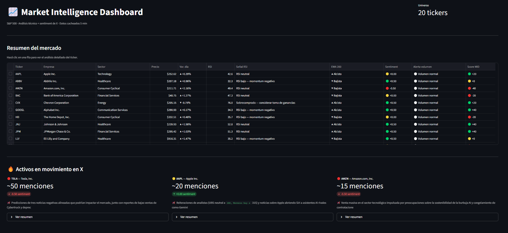

# 📈 Market Intelligence Dashboard — S&P 500


[](https://sp500-analytics-2cyocwl8dqbt6wk8m9zcxh.streamlit.app)

Dashboard interactivo de análisis técnico, sentiment e inteligencia de mercado para las 20 principales acciones del S&P 500. Combina indicadores clásicos de trading con análisis de redes sociales en tiempo real (X/Twitter via Grok) y noticias financieras para generar una visión consolidada del mercado en una sola pantalla.



---

## Features

### Análisis técnico
- **EMA 20 / 50 / 200** — tendencia de corto, mediano y largo plazo
- **RSI (14)** — detección de sobrecompra (>70) y sobreventa (<30)
- **MACD (12-26-9)** — cruces de señal con histograma coloreado
- **Bollinger Bands (20, 2σ)** — bandas rellenas con zona neutral sombreada
- **Señales accionables** generadas automáticamente para cada indicador
- **Gráficos sin gaps de fin de semana** — velas continuas estilo TradingView

### Inteligencia de mercado
- **Sentiment de X/Twitter** — análisis via xAI Grok 4 con búsqueda en vivo de posts
- **Score MID (−60 a +60)** — indicador compuesto que combina RSI + EMA 200 + Sentiment
- **Alertas de volumen institucional** — detecta compra/venta institucional (>2× promedio 20d)
- **Noticias financieras** — últimas 4 noticias por ticker via NewsAPI

### Dashboard
- Panel General con tabla de los 20 tickers ordenable
- Panel Detalle por ticker con tabs: Análisis Técnico · Sentiment · Noticias
- Comparativa de volumen actual vs promedio de 20 días
- Botón de actualización de sentiment en tiempo real desde la UI

---

## Arquitectura

```
                    ┌─────────────┐
                    │   yfinance  │
                    └──────┬──────┘
                           │ OHLCV 2 años
                    ┌──────▼──────┐
                    │   etl.py    │ precios + empresas
                    └──────┬──────┘
                           │
                    ┌──────▼──────────────────────────┐
                    │         data/market.db           │
                    │  empresas · precios · indicadores│
                    │  sentiment · noticias            │
                    └──┬──────────┬────────────┬──────┘
                       │          │            │
              ┌────────▼───┐ ┌────▼──────┐ ┌──▼──────┐
              │technical.py│ │sentiment.py│ │ news.py │
              │EMA/RSI/MACD│ │ xAI Grok  │ │NewsAPI  │
              └────────────┘ └───────────┘ └─────────┘
                       │          │            │
                    ┌──▼──────────▼────────────▼──────┐
                    │             app.py               │
                    │      Streamlit Dashboard         │
                    └─────────────────────────────────┘
```

---

## Instalación y uso local

### Requisitos
- Python 3.11+
- Clave de API de [xAI](https://console.x.ai) (Grok)
- Clave de API de [NewsAPI](https://newsapi.org/register)

### 1. Clonar el repositorio

```bash
git clone https://github.com/tomcedo/SP500-analytics.git
cd SP500-analytics
```

### 2. Instalar dependencias

```bash
pip install -r requirements.txt
```

### 3. Configurar variables de entorno

```bash
cp .env.example .env
# Editar .env con las claves reales
```

### 4. Cargar datos iniciales

```bash
python etl.py           # Descarga 2 años de precios (~2-3 min)
python technical.py     # Calcula indicadores técnicos
python sentiment.py     # Análisis de sentiment via xAI (~30s por ticker)
python news.py          # Descarga noticias recientes
```

### 5. Iniciar el dashboard

```bash
streamlit run app.py
```

Abre en **http://localhost:8501**

### Actualización diaria

```bash
python etl.py && python technical.py && python news.py
# sentiment.py según cuota disponible de xAI
```

---

## Variables de entorno

| Variable | Descripción | Dónde obtenerla |
|----------|-------------|-----------------|
| `XAI_API_KEY` | API de xAI/Grok para análisis de sentiment en X | [console.x.ai](https://console.x.ai) |
| `NEWS_API_KEY` | NewsAPI para descarga de noticias financieras | [newsapi.org/register](https://newsapi.org/register) |

```bash
# .env
XAI_API_KEY=your_xai_api_key_here
NEWS_API_KEY=your_news_api_key_here
```

---

## Deploy en Streamlit Cloud

**Demo en vivo:** [sp500-analytics-2cyocwl8dqbt6wk8m9zcxh.streamlit.app](https://sp500-analytics-2cyocwl8dqbt6wk8m9zcxh.streamlit.app)

1. Hacer fork del repositorio en tu cuenta de GitHub
2. Ir a [share.streamlit.io](https://share.streamlit.io) → **New app**
3. Seleccionar el repo y `app.py` como archivo principal
4. En **Advanced settings → Secrets**, agregar las variables de entorno:

```toml
XAI_API_KEY = "tu_clave_xai"
NEWS_API_KEY = "tu_clave_newsapi"
```

5. Hacer click en **Deploy**

> **Nota:** Streamlit Cloud usa un sistema de archivos efímero. La base de datos SQLite se regenera en cada deploy. Para persistencia en producción, considerar reemplazar SQLite por una base de datos externa (PlanetScale, Supabase, etc.).

---

## Estructura del proyecto

```
sp500-analytics/
├── app.py              Dashboard Streamlit (Panel General + Panel Detalle)
├── etl.py              Descarga precios históricos via yfinance
├── technical.py        Indicadores técnicos via pandas-ta
├── sentiment.py        Sentiment de X via xAI Grok 4
├── news.py             Noticias financieras via NewsAPI
├── verificar.py        Diagnóstico de la base de datos
├── requirements.txt
├── .env.example
└── queries/            Todas las consultas SQL (nunca SQL inline en Python)
    ├── panel_general.sql
    ├── score_mid.sql
    ├── alerta_volumen.sql
    ├── detalle_indicadores.sql
    ├── detalle_precios.sql
    ├── detalle_sentiment.sql
    ├── noticias.sql
    └── ...
```

---

## License

MIT © [tomcedo](https://github.com/tomcedo)
